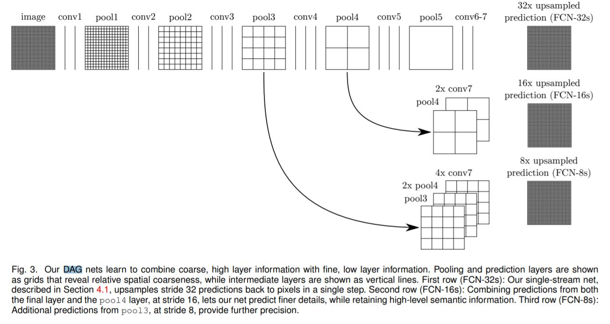
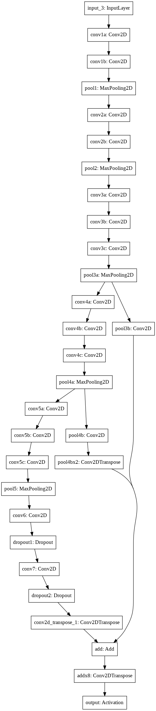

# Semantic-Segmentation

Performing multi-class semantic image segmentation using a fully convolutional network (FCN-8), a skip architecture that combines semantic information from a deep, coarse layer with appearance information from a shallow, fine layer. This model was proposed by Shelhamer, Long & Darrell in [this research paper.](paper.pdf)

## A few links

- Original research paper: [Fully Convolutional Networks for Semantic Segmentation](paper.pdf)
- The dataset used is the sample data prepared by [Divam Gupta.](https://github.com/divamgupta) It can be found in `./dataset` or [here.](https://drive.google.com/file/d/0B0d9ZiqAgFkiOHR1NTJhWVJMNEU/view)
- Pretrained VGG16 weights can be downloaded using [Keras](https://keras.io/applications/#vgg16). They have been stored in `./pretrained_weights` as well.

**Note:** to use `./src/predict.py`, first follow the instructions given in `./checkpoints/instructions.md`.

## Description

The detailed explanation of the model can be found in the aforementioned paper. The model described in the paper:

Visualization of model returned by `./src/create_model.py`:

 

## Result visualisation

Model tested on data in `./dataset/test/`. Some of the results are as follows:

